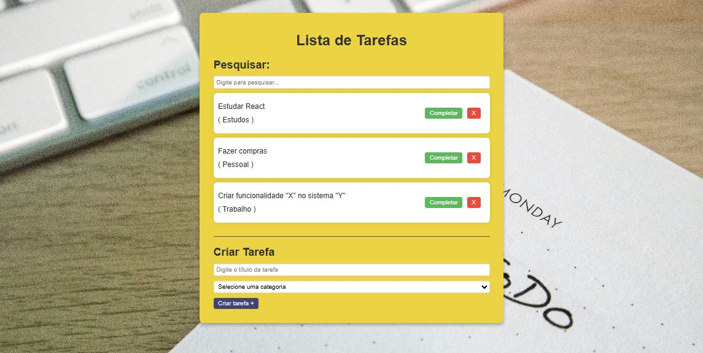

# 📝 Todo List — Projeto em React

Este projeto é uma aplicação de lista de tarefas desenvolvida como parte do meu aprendizado em **React** e para compor meu portfólio.

---

## 📸 Preview  

---

## 🎯 Objetivo do Projeto

Criar uma aplicação simples e funcional de lista de tarefas utilizando **React**, praticando conceitos essenciais como:

- Componentização  
- Estados e eventos  
- Renderização condicional  
- Manipulação de listas  
- Organização de pastas e código

O objetivo principal é reforçar a base do React enquanto desenvolvo um projeto real.

---

## 🛠️ Tecnologias Utilizadas

- **React + Vite**
- **JavaScript (ES6+)**
- **CSS3**
- **Metodologia BEM para organização de classe**
- **Hooks do React (useState)**

---

## 🧠 O que eu aprendi

### ✔️ Fundamentos do React
- Criação de componentes funcionais.
- Utilização do **useState** para gerenciar tarefas.
- Passagem de propriedades entre componentes.
- Atualização de listas de forma imutável.

### ✔️ Estruturação da Aplicação
- Divisão da interface em blocos/componentes reutilizáveis.
- Nomeação de classes CSS usando **BEM**, deixando o código mais claro e escalável.
- Separação entre responsabilidades visuais e lógicas.

---

## 📚 Possíveis Melhorias Futuras

- Implementar **persistência dos dados**.
- Criar modo **dark/light**.
- Adicionar animações nas transições de tarefas.
- Responsividade

---

